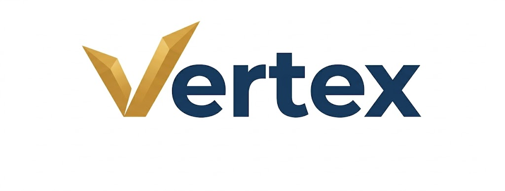

# 🚀 Vertex - Nền Tảng Tin Tức & Tổng Hợp Trí Tuệ Nhân Tạo

<div align="center">
  
  <p><em>Hệ thống tổng hợp tin tức thông minh tích hợp AI tóm tắt và trợ lý ảo chuyên sâu.</em></p>

  [](https://reactjs.org/)
  [](https://www.php.net/)
  [](https://www.mysql.com/)
  [](https://tailwindcss.com/)
</div>

---

## Giới Thiệu
**Vertex** là một giải pháp toàn diện cho việc cập nhật tin tức trong kỷ nguyên số. Hệ thống tự động thu thập tin tức từ các nguồn uy tín, sử dụng mô hình ngôn ngữ lớn (Gemini 2.5 Flash) để tóm tắt nội dung, giúp người dùng tiết kiệm thời gian mà vẫn nắm bắt được những thông tin cốt lõi nhất.

## Tính Năng Nổi Bật

### Trí Tuệ Nhân Tạo (AI)
- **Tóm tắt thông minh**: Tự động trích xuất các ý chính của bài báo dưới dạng gạch đầu dòng súc tích.
- **AI Chatbot**: Trợ lý ảo hỗ trợ giải đáp thắc mắc chuyên sâu dựa trên nội dung từng bài viết.

### Trải Nghiệm Tin Tức
- **Crawler Tự Động**: Hệ thống tự động quét và cập nhật tin tức mới nhất từ VietnamNet và các nguồn báo lớn.
* **Cá nhân hóa**: Lưu tin tức yêu thích, lịch sử xem tin và quản lý hồ sơ người dùng.
- **Tiện ích Thời Tiết**: Cập nhật tình hình thời tiết thời gian thực theo vị trí địa lý.

### Hệ Thống & Bảo Mật
- **Xác thực đa phương thức**: Hỗ trợ đăng nhập truyền thống và Google OAuth 2.0.
- **Phân quyền Admin**: Trang quản trị chuyên sâu quản lý User, Tin tức, Bình luận và Báo cáo.
- **Tài khoản VIP**: Hệ thống nâng cấp VIP tự động qua mã QR (tích hợp SePay).

---

## 🛠️ Công Nghệ Sử Dụng

| Thành phần | Công nghệ |
| :--- | :--- |
| **Frontend** | ReactJS, TypeScript, TailwindCSS, Framer Motion, Lucide Icons |
| **Backend** | Vanilla PHP (PHP 8.x), RESTful API, cURL |
| **Database** | MySQL |
| **AI Engine** | Google Gemini 2.5 Flash API |
| **Tools** | Laragon/XAMPP, npm, Git |

---

## Cấu Trúc Dự Án (Đã Tối Ưu)

```text
GR42/
├── BE/                      # Backend Logic (PHP)
│   ├── database/            # Khởi tạo DB & File SQL backup
│   ├── includes/            # Thư viện Core & Functions
│   ├── modules/             # Xử lý Logic nghiệp vụ
│   │   ├── api/             # RESTful API
│   │   │   ├── auth/        # Đăng ký, Đăng nhập, Google OAuth
│   │   │   ├── news/        # Tải tin, Tóm tắt AI, Bình luận
│   │   │   ├── user/        # Profile, Yêu thích, Lịch sử
│   │   │   ├── payment/     # Thanh toán VIP (SePay)
│   │   │   └── tools/       # Thời tiết, Crawler
│   │   └── ssr/             # Các module giao diện PHP cũ (Legacy)
│   └── index.php            # Router thông minh (Hỗ trợ Smart Routing)
│
├── react/                   # Frontend SPA (React)
│   ├── src/
│   │   ├── components/      # UI Components tái sử dụng
│   │   ├── modules/         # Các Feature Modules (News, Article, Profile...)
│   │   └── constants/       # Cấu hình API & Biến môi trường
│   └── package.json         # Quản lý dependencies
│
└── .env                     # Cấu hình bảo mật (API Keys, DB Config)
```

---

## 🚀 Hướng Dẫn Cài Đặt

### 1. Chuẩn bị Backend
1. Đặt thư mục `GR42` vào `www` của Laragon.
2. Khởi động Apache và MySQL.
3. Tạo database tên `crawl_news` và import file trong `BE/database/crawl_news.sql`.
4. Cấu hình file `.env` ở thư mục gốc (tham khảo `.env.example`).

### 2. Chuẩn bị Frontend
1. Mở terminal tại thư mục `react`.
2. Chạy lệnh: `npm install` để cài đặt thư viện.
3. Chạy lệnh: `npm start` để khởi chạy giao diện.

---

## Đội Ngũ Phát Triển
Dự án được phát triển bởi nhóm GR42 với mục tiêu mang lại trải nghiệm đọc tin tức hiện đại và thông minh nhất.

